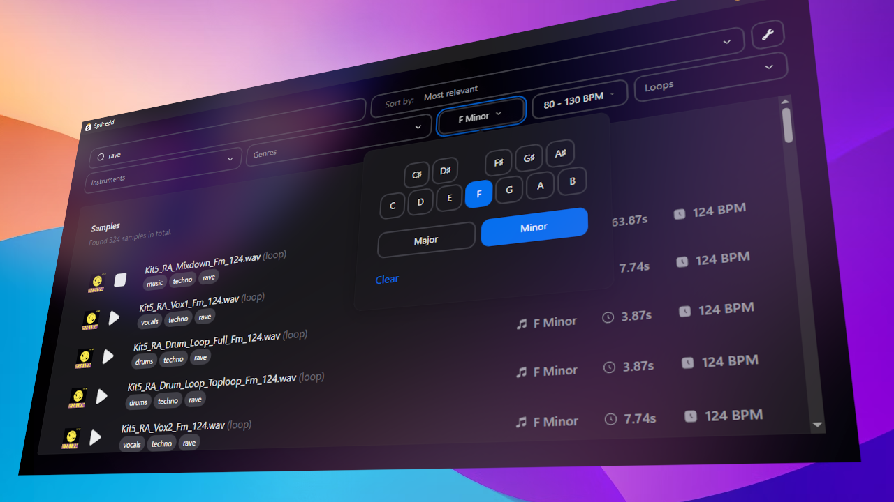

#  splicedd
**Splicedd** is an alternative frontend for the popular [Splice](https://splice.com/features/sounds) sample library. It does not require any kind of authentication, and contains all of the most important features of the regular desktop app (including drag-and-drop).

  <a href="https://github.com/ascpixi/splicedd/releases/"><code>click here to download the latest release!</code></a>
    
  

Basic demo  | Drum loop demo 
------------|---------------
<video src="https://github.com/ascpixi/splicedd/assets/44982772/4406e3a2-1361-4198-baf9-cca5b4fb62af"> | <video src="https://github.com/ascpixi/splicedd/assets/44982772/02dda4ce-d61c-4240-8759-bbd18c31de24">
